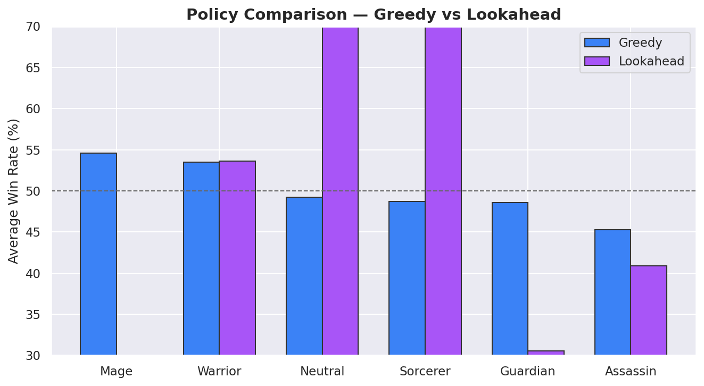
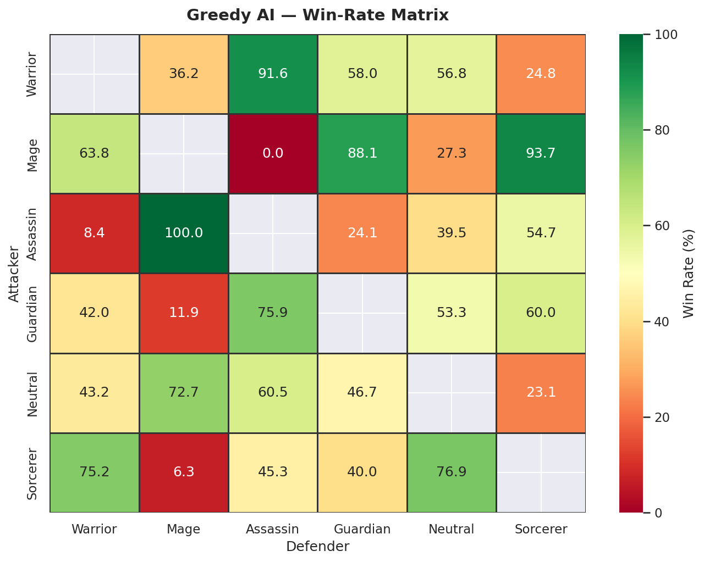

# Crestbound Duelists

A simulation-driven analysis of decision-making under uncertainty in adversarial systems, using Monte Carlo methods and game theory.

---

## Overview

This project models a turn-based combat system as a stochastic game to study how different decision policies perform under uncertainty.

**Core question:**  
When does randomness force optimal strategies to become mixed rather than deterministic?

Instead of treating this as a game implementation, the focus is on:
- policy evaluation  
- probabilistic outcomes  
- strategic stability  

---

## System Design

The environment consists of:
- multiple character classes with distinct attributes  
- a defined set of actions (attack, defend, special)  
- stochastic resolution (damage, outcomes, and effects are probabilistic)  

Each interaction produces uncertain outcomes, making deterministic optimisation unreliable.

---

## Methodology

### 1. Simulation
- Monte Carlo simulations are used to evaluate policy performance across many runs  
- Each policy is tested over large samples to estimate expected value and variance  

### 2. Policies Evaluated
- Greedy policies (locally optimal decisions)  
- Rule-based strategies  
- Mixed strategies derived from payoff structures  

### 3. Game-Theoretic Analysis
- Payoff matrices are constructed from simulation outcomes  
- Nash equilibria are approximated to identify stable strategies under adversarial play  

---

## Key Findings

- Greedy policies underperform in stochastic environments due to lack of adaptability  
- Mixed strategies emerge as optimal when outcomes are uncertain and adversarial  
- Strategy stability matters more than peak performance in repeated interactions  

---

## Results

### Policy Comparison

### Strategy Behaviour

---

## Why This Matters

This setup mirrors real-world systems where:
- outcomes are uncertain  
- agents interact competitively  
- decisions must be made without full information  

Examples include:
- recommendation systems (uncertain user behaviour)  
- pricing and auctions  
- adversarial ML and strategic modelling  

---

## Tech Stack

- Python  
- NumPy / simulation logic  
- Jupyter Notebook (analysis)  
- Custom game engine  

---

## Structure

- `main.py` → entry point  
- `simulation.py` → Monte Carlo simulation logic  
- `combat.py` → game mechanics  
- `models.py` → data structures  
- `nash.py` → equilibrium analysis  
- `analysis.ipynb` → exploratory analysis  

---

## Takeaway

In adversarial systems with uncertainty, the best strategy is rarely a single choice.

It is a distribution.
