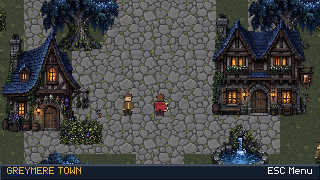
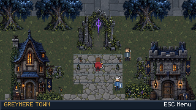
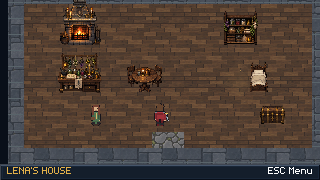

# Greymere rebuild: implementation and visual QA

Status: review branch `world/greymere-rebuild`; not a completed visual-overhaul
release. Combat resolution and balance are unchanged.

## Implemented

- Authored 34x34 exterior with four distinct buildings, Court stairs/gate,
  western creek and bridge, paths, trees, spring, lamps and contextual interactions.
- Three playable furnished interiors: Lena's house, the inn and Silas's study.
  Doors use shared destination/return-spawn metadata. Guardhouse is intentionally
  locked rather than leading to an empty room.
- Shared world catalog, source-region/foot-anchor prop placement, collision
  footprints, Y-sorted actors/props, bounded rounded camera follow and transitions.
- Location-aware save/load including current tile/facing; migration of older saves.
- Bottom location/context HUD and working Resume / Save game / Title screen menu.
- Native 320x180 viewport rendering and integer browser scaling without the old
  size cap, CSS transform or external controls paragraph.
- Reference audit covering all Greymere residents and six Kai classes. Long
  silver hair for Almyra and green cap for Gell are explicitly locked.

## Assets and ownership

New production environment sheets are `game/assets/environment/buildings.png`,
`outdoors.png`, `furniture.png` and `terrain.png`. Their metadata is
`game/assets/environment/environment.json`. They were generated using the built-in
image-generation tool and integrated as individual props/materials, not a static
town screenshot. The terrain was revised after native-resolution renders exposed
excessive noise and visible floor seams.

`tools/build_greymere_world.py` owns `game/world/locations.json`; regenerate rather
than manually edit that output. Narrative/balance YAML and exported combat data
were not changed. Existing legacy dialogue IDs remain stable compatibility keys;
the displayed elder is Elder Silas.

Character candidates are in `docs/visual_refs/character_candidates/`, outside the
Godot project/export. Neutral Kai, Almyra and Gell retain their selected reference
identities but have not passed animation QA. Their prompts and specific defects
are recorded beside them. They must not be described as finished runtime sprites.

## Verification evidence

- Local static validator: 50 scripts, 10 scenes, 41 JSON files; passed.
- Focused tests: 15 passed (world connectivity, presentation contracts, complete
  character-reference coverage and source existence).
- Actual Godot `world_smoke.tscn`: zero failures. Exercises tile movement,
  contextual entry, locked doors, three interior visits, save/load/reload,
  resident dialogue, furniture inspection, return spawn and Court/party setup.
- Existing `presentation_smoke.tscn`: zero failures, including normal battle
  victory and forced defeat. Existing missing authored VFX warnings remain.
- GitHub run [34227606475](https://github.com/Ghobi-A/Crestbound-Duelists/actions/runs/34227606475)
  passed native rendered scene capture, both smoke flows, Web release export and
  Playwright checks at 1920x1080, 1280x720, 1024x768 and 640x360, with no page errors.
  Browser screenshots show keyboard progression into town and the menu. Dimensions
  of the backing buffer and CSS canvas match at each integer scale.
- The preceding browser-export failure was a QA setup error: only the threaded
  release template was installed. The workflow now installs the no-thread Web
  templates required by the project's existing export configuration.
- Final quieter terrain and camera look-ahead passed the same checks in
  [run 34228275647](https://github.com/Ghobi-A/Crestbound-Duelists/actions/runs/34228275647)
  on runtime commit `b1cb431ae8d71373d04208aa358abf93b2058c65`. The actual renders
  were inspected: terrain is less noisy, floor seams are reduced and the Court
  gate is fully visible from the tested approach. Character/environment mismatch
  remains visible and is not accepted as finished art.

Captured native-resolution evidence:

Local Xvfb cannot create display sockets in this environment. Native rendered
verification therefore runs on the GitHub Linux runner; headless gameplay tests
also run locally. This is actual Godot rendering, not a screenshot mockup.

## Visual acceptance checklist

- [x] Four recognizable exterior buildings and three usable interiors.
- [x] Doors and return spawns reachable from every declared spawn.
- [x] Save/load preserves the interior and player placement.
- [x] Context prompts replace permanent markers scattered across town.
- [x] Native rendering and four supported browser sizes verified.
- [x] Existing portrait/reference inventory and alias mapping completed.
- [x] Almyra's long silver hair and Gell's green cap locked in the audit.
- [ ] New full directional character animation sheets accepted and integrated.
- [ ] All residents match the authored environment's style in live gameplay.
- [ ] Candidate feet, stride alternation and equipment-side continuity verified.
- [ ] Final environmental composition reaches the supplied reference's quality.
- [ ] All remaining battle/portrait/VFX presentation gaps closed.
- [ ] Completed visual rebuild merged and deployed to Pages.

## Remaining limitations

The production path still uses the previous procedural character walkers, whose
identity/style problems motivated the audit. Three better reference-derived
candidates exist, but repeated stride poses and equipment continuity require
further work; the other character animation replacements are not started. No
substitute character art was silently shipped to make checks pass.

The environment is a substantial functional rebuild, not yet the supplied target
image's finished art quality. In particular, asset pixel density, lighting,
terrain transitions and character/environment cohesion still need visual work.
The browser supports integer fit at or above 320x180; a smaller browser window
cannot display that native viewport in full without scrolling/cropping. Touch
movement controls are not implemented.

The broader combat presentation pass remains separate: existing system-pulse VFX
fallback warnings are not resolved by this town work. Do not treat smoke-test
success as evidence that every art requirement is complete.

## Changed implementation files

- Runtime: `game/scripts/overworld/{greymere,world_location,world_catalog,world_prop,world_terrain,world_atmosphere,world_hud}.gd`
- Persistence: `game/scripts/core/game_state.gd`
- Locations: `game/scenes/overworld/{lena_house,inn,silas_study}.tscn`, `game/world/locations.json`, `tools/build_greymere_world.py`
- Rendering/browser: `game/project.godot`, `game/web/shell.html`
- Environment: the four PNG sheets and import sidecars plus `game/assets/environment/environment.json`
- QA: `game/scripts/tools/{screenshot_capture,world_smoke}.gd`, `game/scenes/tools/world_smoke.tscn`, `tools/verify_world_web.mjs`, `.github/workflows/greymere-world-qa.yml`
- Tests: `tests/test_world_locations.py`, `tests/test_presentation_contracts.py`, `tests/test_greymere_character_references.py`
- Reference records: `docs/rework/GREYMERE_CHARACTER_REFERENCE_AUDIT.md`, `docs/rework/greymere_character_references.json`, and the candidate directory listed above.
