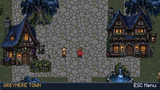
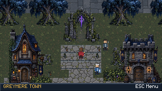
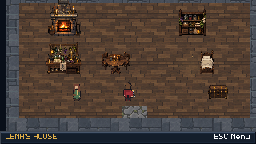

# Greymere rebuild: implementation and visual QA

Status: review branch `world/greymere-rebuild`; not a completed visual-overhaul
release. Combat resolution and balance are unchanged.

## Implemented

- Authored 34x34 exterior with four distinct buildings, Court stairs/gate,
  western creek and bridge, paths, trees, spring, lamps and contextual interactions.
- Three playable furnished interiors: Lena's house, the inn and Silas's study.
  Doors use shared destination/return-spawn metadata. Guardhouse is intentionally
  locked rather than leading to an empty room.
- Shared world catalog, source-region/foot-anchor prop placement, collision
  footprints, Y-sorted actors/props, bounded rounded camera follow and transitions.
- Location-aware save/load including current tile/facing; migration of older saves.
- Bottom location/context HUD and working Resume / Save game / Title screen menu.
- Native 320x180 viewport rendering and integer browser scaling without the old
  size cap, CSS transform or external controls paragraph.
- Reference audit covering all Greymere residents and six Kai classes. Long
  silver hair for Almyra and green cap for Gell are explicitly locked.
- Seventeen new runtime overworld sheets share Kai's proportions and four explicit
  directional rows. The central registry records each frame and foot baseline;
  Mage and Sorcerer wear robes, and Neutral keeps the magical sword motif.
- Shared raised-slate panel surfaces now unify the pause, dialogue, formation and
  battle status UI. Party cards have separate name/status space, and the details
  panel shows class/Crest metadata rather than empty missing-art slots. Native
  HP text and green/amber health bars replace the downsampled status caption.
- The opening controls objective names Warden Almyra. A player-facing canon
  guard prevents retired character names from returning in runtime text.

## Assets and ownership

New production environment sheets are `game/assets/environment/buildings.png`,
`outdoors.png`, `furniture.png` and `terrain.png`. Their metadata is
`game/assets/environment/environment.json`. They were generated using the built-in
image-generation tool and integrated as individual props/materials, not a static
town screenshot. The terrain was revised after native-resolution renders exposed
excessive noise and visible floor seams.

`tools/build_greymere_world.py` owns `game/world/locations.json`; regenerate rather
than manually edit that output. Narrative/balance YAML and exported combat data
were not changed. Existing legacy dialogue IDs remain stable compatibility keys;
the displayed elder is Elder Silas.

Earlier character candidates remain in `docs/visual_refs/character_candidates/`,
outside the export. The newer production sheets live in `game/assets/overworld/`.
The sheet registry has `animation_review: pending` on each entry, since side walk
contact poses still need refinement. See `AUTHORED_OVERWORLD_PASS.md`.

## Verification evidence

- Local static validator: 50 scripts, 10 scenes, 42 JSON files; passed.
- Full Python regression: 259 passed after the interface and canon guard pass.
- Actual Godot `world_smoke.tscn`: zero failures. Exercises tile movement,
  contextual entry, locked doors, three interior visits, save/load/reload,
  resident dialogue, furniture inspection, return spawn and Court/party setup.
- Existing `presentation_smoke.tscn`: zero failures, including normal battle
  victory and forced defeat. Existing missing authored VFX warnings remain.
- GitHub run [34227606475](https://github.com/Ghobi-A/Crestbound-Duelists/actions/runs/34227606475)
  passed native rendered scene capture, both smoke flows, Web release export and
  Playwright checks at 1920x1080, 1280x720, 1024x768 and 640x360, with no page errors.
  Browser screenshots show keyboard progression into town and the menu. Dimensions
  of the backing buffer and CSS canvas match at each integer scale.
- The preceding browser-export failure was a QA setup error: only the threaded
  release template was installed. The workflow now installs the no-thread Web
  templates required by the project's existing export configuration.
- Final quieter terrain and camera look-ahead passed the same checks in
  [run 34228275647](https://github.com/Ghobi-A/Crestbound-Duelists/actions/runs/34228275647)
  on runtime commit `b1cb431ae8d71373d04208aa358abf93b2058c65`. The actual renders
  were inspected: terrain is less noisy, floor seams are reduced and the Court
  gate is fully visible from the tested approach. Character/environment mismatch
  remains visible and is not accepted as finished art.
- The unified overworld pass in [run 36266924359](https://github.com/Ghobi-A/Crestbound-Duelists/actions/runs/36266924359)
  passed metadata regeneration, 17 focused tests, actual Godot captures of all
  six Kai classes and the town/interiors, movement/save/combat smoke, Web export
  and browser checks at four viewport sizes. The captured town and interior
  scenes were inspected: the authored walkers align to ground, fit within the
  play area, and the game and browser menus remain within the canvas. This run
  predates the later interface spacing refinement.
- The interface and dialogue capture pass in [run 36269492378](https://github.com/Ghobi-A/Crestbound-Duelists/actions/runs/36269492378)
  passed Godot scene captures, both smoke flows, Web export and browser checks.
  Its party and two dialogue frames were inspected at native pixel scale:
  portraits remain in their frames, text clears the portraits, no roster row
  bleeds into the next panel, and missing Crest/entity art no longer creates
  empty image boxes. The new modal scrim landed after this run.

Captured native-resolution evidence:

Local Xvfb cannot create display sockets in this environment. Native rendered
verification therefore runs on the GitHub Linux runner; headless gameplay tests
also run locally. This is actual Godot rendering, not a screenshot mockup.

## Visual acceptance checklist

- [x] Four recognizable exterior buildings and three usable interiors.
- [x] Doors and return spawns reachable from every declared spawn.
- [x] Save/load preserves the interior and player placement.
- [x] Context prompts replace permanent markers scattered across town.
- [x] Native rendering and four supported browser sizes verified.
- [x] Existing portrait/reference inventory and alias mapping completed.
- [x] Almyra's long silver hair and Gell's green cap locked in the audit.
- [x] New directional sheets for the Greymere cast and six Kai classes integrated.
- [ ] All residents match the authored environment's style in live gameplay.
- [ ] Candidate feet, stride alternation and equipment-side continuity verified.
- [ ] Final environmental composition reaches the supplied reference's quality.
- [ ] All remaining battle/portrait/VFX presentation gaps closed.
- [ ] Side contact poses pass `tools/audit_walk_cycles.py` (stride rebuild
  fixed 12 of 20; 8 low-contrast facings still need hand-redrawn contact
  poses; foot-anchor jitter passes).
- [x] Native HD output: the 320x180 layout draws at 2x/4x/6x through
  `canvas_items` stretch, sampling the 1-2k px source sheets at output size.
- [ ] Completed visual rebuild merged and deployed to Pages.

## Remaining limitations

The Greymere cast and Kai now use the authored sheets. Some generated side-view
contact poses remain similar across the cycle and need an animation polish pass.
The prior procedural walkers remain available only for unmapped actors elsewhere;
they are not substituted for registered Greymere characters.

The environment is a substantial functional rebuild, not yet the supplied target
image's finished art quality. In particular, asset pixel density, lighting,
terrain transitions and character/environment cohesion still need visual work.
The browser supports integer fit at or above 320x180; a smaller browser window
cannot display that native viewport in full without scrolling/cropping. Touch
movement controls are not implemented.

The broader combat presentation pass remains separate: existing system-pulse VFX
fallback warnings are not resolved by this town work. Do not treat smoke-test
success as evidence that every art requirement is complete.

## Changed implementation files

- Runtime: `game/scripts/overworld/{greymere,world_location,world_catalog,world_prop,world_terrain,world_atmosphere,world_hud}.gd`
- Persistence: `game/scripts/core/game_state.gd`
- Locations: `game/scenes/overworld/{lena_house,inn,silas_study}.tscn`, `game/world/locations.json`, `tools/build_greymere_world.py`
- Rendering/browser: `game/project.godot`, `game/web/shell.html`
- Environment: the four PNG sheets and import sidecars plus `game/assets/environment/environment.json`
- QA: `game/scripts/tools/{screenshot_capture,world_smoke}.gd`, `game/scenes/tools/world_smoke.tscn`, `tools/verify_world_web.mjs`, `.github/workflows/greymere-world-qa.yml`
- Tests: `tests/test_world_locations.py`, `tests/test_presentation_contracts.py`, `tests/test_greymere_character_references.py`
- Reference records: `docs/rework/GREYMERE_CHARACTER_REFERENCE_AUDIT.md`, `docs/rework/greymere_character_references.json`, and the candidate directory listed above.
- Character runtime: `game/assets/overworld/{*.png,authored.json}`, `game/scripts/overworld/overworld_sprite.gd`, `tools/build_overworld_metadata.py`, and `tests/test_authored_overworld.py`.
